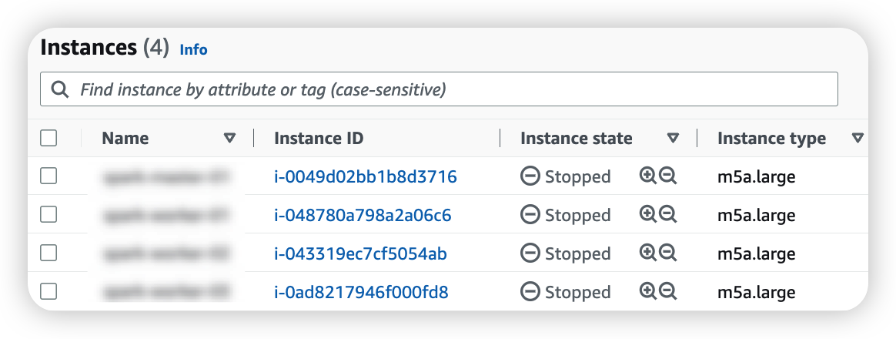

# Apache Spark

## Lab Environment
### Server : Amazon EC2
- Instance Type : m5a.large
- Instance Count : Total 4 EA (Master 1EA / Worker 3EA)
- Core : 2 CPUs
- Memory : 8 GiB
- Disk : 50 GiB
- OS : Ubuntu Server (20.04 LTS), 64 bits (x86)

<br/>

* * *

<br/>

## Set Environment Configuration
- [x] (1) EC2 Instance 생성
- [x] (2) 각 서버에 OS User 생성 및 sudo 권한 설정
- [x] (3) 각 서버에 Utils 설치
- [x] (4) 각 서버에 Host Name 설정
- [x] (5) 각 서버 간 SSH Connection(w/o) 가능하도록 설정

<br/>

***

<br/>

## Step-by-Step Details

<br/>

### (1) EC2 Instance 생성
- 총 4개의 EC2 Instance 생성

- SSH Key 파일 저장 및 저장한 경로 기억하기
    - Chrome에서 .pem 파일이 다운로드 되지 않는 이슈 (.cer 파일로 저장됨)
    - Safari에서 .pem 파일 다운로드
- 각각의 서버마다 SSh Client Connection Test
    - `ssh -i "*********.pem" ubuntu@<Public DNS>`

<br/>

### (2) 각 서버에 OS User 생성 및 sudo 권한 설정
- `sudo useradd {OS User Name} -m -s /bin/bash`
    - '-m' : OS User 생성 시, 홈 디렉토리 생성하는 옵션
    - '-s' : OS User가 사용할 Shell 지정
- 계정 전환 시, 패스워드 입력하지 않도록 설정
    - `sudo vi /etc/sudoers`
    - > {OS User Name} ALL=(ALL) NOPASSWD:ALL
- 디렉토리 생성 및 신규 생성한 OS User로 소유자 변경
    - `sudo mkdir {Directory Name}`
    - `sudo chown {Owner: OS User Name}:{Group: OS User Name} {Directory Name}`

<br/>

### (3) 각 서버에 Utils 설치
- wget, unzip, bzip2, net-tools 설치
    - `sudo apt install -y wget unzip bzip2 net-tools`
    
<br/>

### (4) 각 서버에 Host Name 설정
- 각 서버 별로 Host Name을 다르게 설정
    - `sudo hostnamectl set-hostname {Master Node Host Name}`
    - `sudo hostnamectl set-hostname {Worker Node 1 Host Name}`
    - `sudo hostnamectl set-hostname {Worker Node 2 Host Name}`
    - `sudo hostnamectl set-hostname {WorkerNode 3 Host Name}`
- 서버 간 통신에 ip 대신 Host Name으로 통신할 수 있도록 구성
    - 각 서버 별로 Private IP 주소를 모두 확인
        - `ifconfig`
    - Host Name으로 IP를 확인할 수 있도록 각 서버 별 아래와 동일한 내용으로 /etc/hosts 파일 편집
```text
{Master Node Private IP} {Master Node Host Name}
{Worker Node 1 Private IP} {Worker Node 1 Host Name}
{Worker Node 2 Private IP} {Worker Node 2 Host Name}
{Worker Node 3 Private IP} {Worker Node 3 Host Name}
```

<br/>

### (5) 각 서버 간 SSH Connection(w/o) 가능하도록 설정
- 서버 간 Password 입력 없이 RSA Key 기반 SSH 연결하기 설정
    - SSH Key Generate
        - `ssh-keygen -t rsa -P '' -f ~/.ssh/{RSA Key File Name}`
    - Public Key, Private Key Pair가 생성됨
        - > {RSA Key File Name}
        - > {RSA Key File Name}.pub
    - Authorized Keys 구성
        - Key 기반 서버 인증을 위해 인가(Authorized)된 Key 파일 구성
        - Server 자체적으로도 SSH 접속을 허용하도록 Public Key 내용으로 Authorized Keys 파일 구성
        - 다른 Server의 SSH 접속을 허용하기 위해 다른 Server의 Public Key를 복사하여, Authorized Keys 파일에 붙여넣기
        - Authorized Keys 파일은 SSH 접근을 허용하는 서버의 Public Key 내용을 저장하는 아주 중요한 File이기 때문에 동일 서버 내 다른 OS User가 읽을 수 없도록 파일 권한 변경
            - `chmod 600 {Authorized Keys File Path}`
