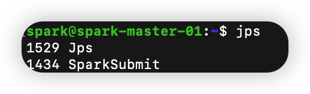
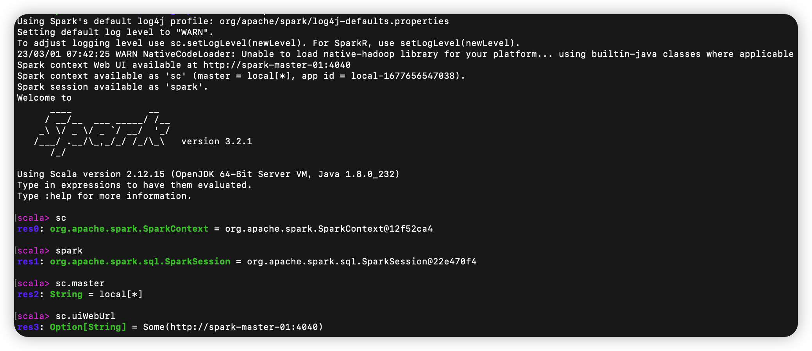
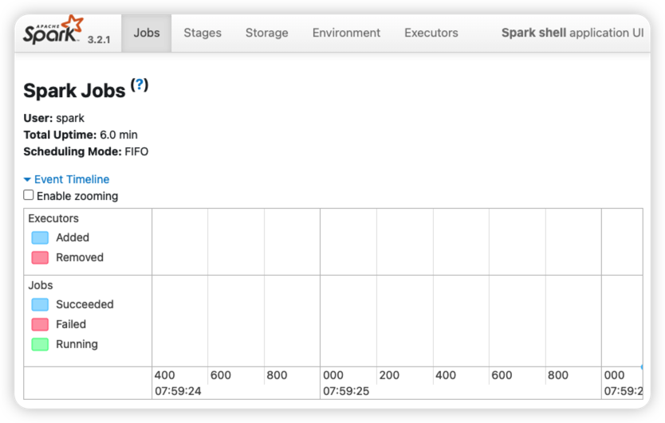

# Install Spark on Master Node

## Spark Tarball Download
- Version : spark 3.2.1 pre-built
- Download Path : https://archive.apache.org/dist/spark/
```bash
$ cd /{base_dir}
$ wget https://archive.apache.org/dist/spark/spark-3.2.1/spark-3.2.1-bin-hadoop3.2.tgz
$ tar xvfz spark-3.2.1-bin-hadoop3.2.tgz
$ mv spark-3.2.1-bin-hadoop3.2 spark3
```

<br/>

## JAVA (OpenJDK8) Download
```bash
$ cd /{base_dir}
$ https://github.com/ojdkbuild/contrib_jdk8u-ci/releases/download/jdk8u232-b09/jdk-8u232-ojdkbuild-linux-x64.zip
$ unzip jdk-8u232-ojdkbuild-linux-x64.zip
$ mv jdk-8u232-ojdkbuild-linux-x64 jdk8
```

<br/>

## JAVA_HOME 환경변수 설정
```bash
$ cd /{base_dir}/spark3/conf
$ cp spark-env.sh.template spark-env.sh
$ vi spark-env.sh # 
```
```text
JAVA_HOME=/{base_dir}/jdk8
```

<br/>

## JPS 명령어에 대한 PATH 등록
```bash
$ vi ~/.profile
```
```text
export PATH=/{base_dir}/jdk8/bin:$PATH
```
```bash
$ source ~/.profile
$ jps
```

- SparkSubmit은 spark-shell의 프로세스이며, Driver의 프로세스


<br/>

## spark-shell 실행
```bash
$ cd /{base_dir}/spark3
$ ./bin/spark-shell
```

<br/>


- sc.master에 대한 return을 보면 local[*]로 반환함
    - 이는 Spark Standalone Cluster Manager를 구성한 것이 아닌 단순히 Spark Shell을 실행하여 Spark Local 환경을 구성한 것
- Local Spark Shell의 application Web UI를 확인하기 위해서 4040 port 방화벽 오픈
    - AWS EC2의 Security Group의 Inbound Rule 편집

