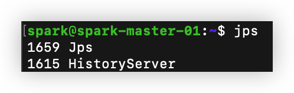
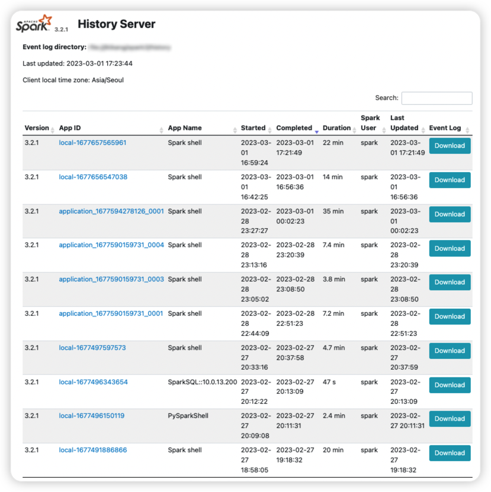

# Spark History Server 구성

## Log Directory 설정 for Spark History Server
```bash
$ cd /{base_dir}/spark3/conf
$ cp spark-defaults.conf.template spark-defaults.conf
$ vi spark-defaults.conf
```
```text
spark.history.fs.logDirectory file:///{base_dir}/spark3/history
```
```bash
$ mkdir -p /{base_dir}/spark3/history
```

<br/>

## Log Directory 설정 for Spark Application
```bash
vi /{base_dir}/spark3/conf/spark-defaults.conf
```
```text
spark.eventLog.enabled true
spark.eventLog.dir file:///{base_dir}/spark3/history
```

<br/>

## Spark History Server Start
```bash
$ /{base_dir}/spark3/sbin/start-history-server.sh
```
```bash
$ jps
```


<br/>

## Spark History Server Web UI 확인

- 필요 시, 18080 port에 대해서 방화벽 오픈 필요
- spark session이 종료되더라도 spark history server web ui에서 정상적으로 종료된 spark application과 비정상적으로 종료된 spark application 모두 확인할 수 있다.

<br/>

## Spark History Server Log Directory 확인
- 앞서 spark_defaults.conf에 Spark History Server에 Log가 기록되는 default path와 모든 Spark Application에 대한 Log 또한 Spark History Server의 default path에 쌓이도록 설정함
- 현재 진행중인 Spark Application의 Log는 ~.inprogress로 끝나게 되고 정상적으로 종료되면 ~.inprogress가 없이 Log가 저장되어서 Spark History Server에서는 현재 실행중이지 않은 또는 이전에 실행되었던 모든 Spark Application에 대한 로그를 볼 수 있다.