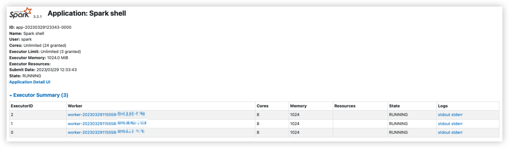
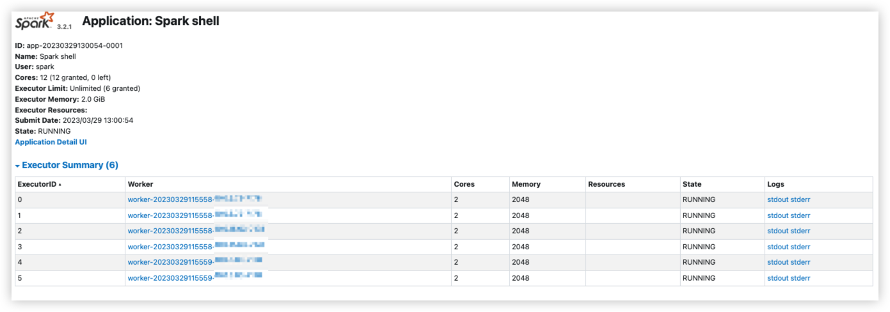
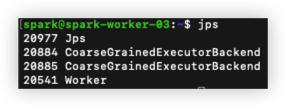

# Spark Standalone Cluster Manager

## Spark Standalone Cluster 내 workers 설정
- Spark Application에서 수행될 작업들에 필요한 Executor들을 Spark Standalone Cluster Manager에게 요청하기 위한 Worker Server들을 명시할 필요가 있음
```bash
$ cp /{base_dir}/spark3/conf/workers.template /{base_dir}/spark3/conf/workers
$ vi /{base_dir}/spark3/conf/workers
```
```text
{Worker 1 Host Name}
{Worker 2 Host Name}
{Worker 3 Host Name}
```

<br/>

## Copy spark3 to Each Worker Server 01 ~ 03 on Master Server
- 앞서 hadoop 설정을 위해 각 worker server들에 hadoop, jdk8을 이미 copy 수행했기 때문에 모든 worker server는 hadoop과 jdk8에 대한 conf를 모두 가지고 있음
- 따라서, 앞서 수정한 worker server에 대한 conf를 worker server들에게 copy
```bash
$ scp -r /{base_dir}/spark3 {OS User Name}@{Worker 1 Host Name}:/{base_dir}
$ scp -r /{base_dir}/spark3 {OS User Name}@{Worker 2 Host Name}:/{base_dir}
$ scp -r /{base_dir}/spark3 {OS User Name}@{Worker 3 Host Name}:/{base_dir}
```

<br/>

## Spark Standalone Cluster Manager Start

<br/>

### Default

<br/>

```bash
$ /{base_dir}/spark3/sbin/stop-all.sh
$ /{base_dir}/spark3/sbin/start-all.sh
```
- Master Server Default Port : 8080
- Master Server Web UI Default Port : 7077
- Worker Server Default Port : Random
- Worker Server Web UI Default Port : 8081
- Worker Server Default Core : 2 (default: all available)
- Worker Server Default Memory : 6.5 GiB

<br/>

### Public DNS, Port, Cores, Memory 변경

<br/>

- Master Server Port 변경
- Master Server Web UI Port 변경
- Worker Server Port 변경
- Worker Server Web UI Port 변경
- Worker Server 당 할당받는 CPU 개수 변경
- Worker Server 당 할당받는 Memory 변경
- Worker Server Web UI DNS 주소를 Private IP 주소가 아닌 Hostname으로 접근할 수 있도록 Public DNS 설정

<br/>

> 변경된 각 Port에 대해서 EC2 보안그룹에서 Inbound Rules 편집

<br/>

```bash
$ vi /{base_dir}/spark3/conf/spark-env.sh
```
```text
JAVA_HOME=/{base_dir}/jdk8
SPARK_MASTER_PORT=****  # default: 7077
SPARK_MASTER_WEBUI_PORT=****  # default: 8080
SPARK_WORKER_PORT=****  # default: random
SPARK_WORKER_WEBUI_PORT=****  # default: 8081
SPARK_WORKER_CORES=8  # default: all available
SPARK_WORKER_MEMORY=8G  # default: machine's total RAM minus 1 GiB
SPARK_PUBLIC_DNS=${HOSTNAME}
```

<br/>

- Master Server에서 spark-env.sh 변경을 수행할 때 마다, 모든 Worker Server에 copy하는 작업 수행
```bash
$ scp -r /{base_dir}/spark3 {OS User Name}@{Worker 1 Host Name}:/{base_dir}
$ scp -r /{base_dir}/spark3 {OS User Name}@{Worker 2 Host Name}:/{base_dir}
$ scp -r /{base_dir}/spark3 {OS User Name}@{Worker 3 Host Name}:/{base_dir}
```

<br/>

- Master Server에서 spark-env.sh 변경을 수행할 때 마다, Spark Standalone 재가동 및 Web UI 확인
```bash
$ /{base_dir}/spark3/sbin/stop-all.sh
$ /{base_dir}/spark3/sbin/start-all.sh
```

<br/>


<br/>

## Spark Application on Spark Standalone

<br/>

### With --master spark://host:port

<br/>

```bash
$ cd /{base_dir}/spark3
$ ./bin/spark-shell --help
```


```bash
$ ./bin/spark-shell --master spark://{Master Host Name}:{SPARK_MASTER_PORT}
```




- Spark Master Server Web UI와 Spark Application Web UI에서 보이는 것 처럼 총 3개의 Executor가 할당된 것을 확인할 수 있고, 각 Executor 마다 8개의 core를 할당받으면서 클러스터의 가용한 모든 core를 할당받은 모습을 볼 수 있다.
- Spark 클러스터 내에서 여러 개의 Spark Application이 실행될 수 있기 때문에 하나의 Spark Application에서 클러스터 내 가용한 모든 자원을 할당받게 되면 문제가 발생할 수 있다.

<br/>

### With --master spark://host:port & With memory, cores, total Options

<br/>

```bash
$ cd /{base_dir}/spark3
$ ./bin/spark-shell --help
```


```bash
$ ./bin/spark-shell --master spark://{Master Host Name}:{SPARK_MASTER_PORT} --executor-memory 2G --executor-cores 2 --total-executor-cores 12
```




- Spark Master Server Web UI와 Spark Application Web UI에서 보이는 것 처럼 총 3개의 Worker Server에 2개의 core와 2048 MiB Memory를 가진 각각의 Executor를 2개씩 가지고 있는 것을 볼 수 있다.

<br/>

### Master & Worker Server 프로세스 확인

<br/>

- 클러스터 내 각각의 Worker Server의 동작중인 프로세스는 다음과 같다.
    - JPS
    - Worker
    - CoarseGrainedExecutorBackend



